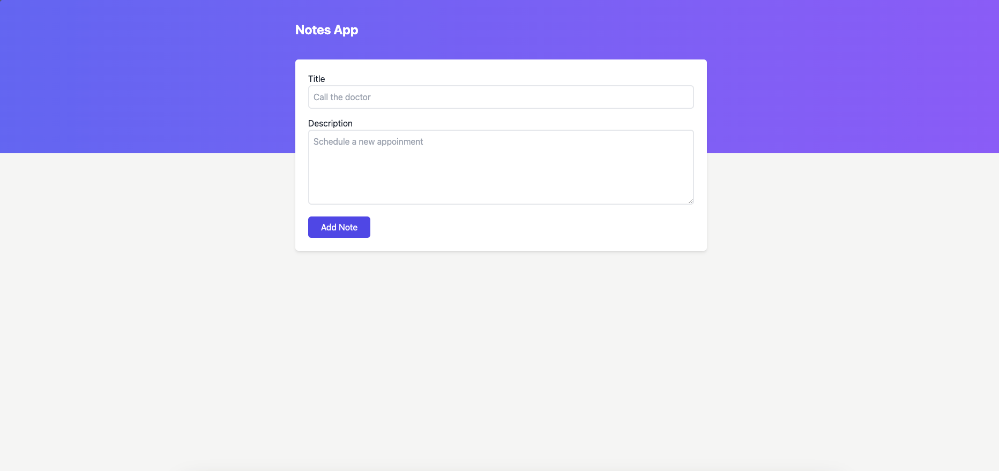
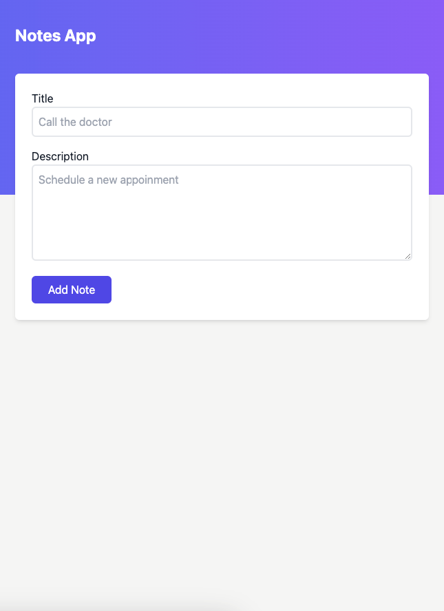
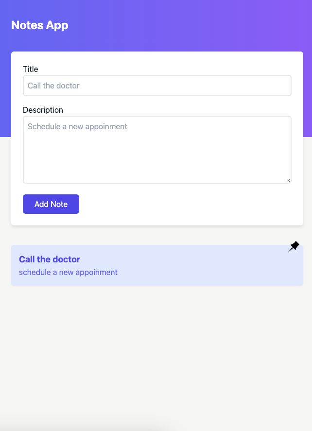

# Notes App

A simple Notes App built with **React**, **Vite**, and **Tailwind CSS**. This application allows users to create and manage notes.

## Table of Contents
- [Introduction](#introduction)
- [Features](#features)
- [Technologies Used](#technologies-used)
- [Getting Started](#getting-started)
    - [Installation](#installation)
    - [Running the App](#running-the-app)
- [Screenshots](#screenshots)

## Introduction

This project aims to create a simple notes application that meets the following acceptance criteria:

- Displays a form with fields for **Title** and **Description** on the homepage.
- Notes are displayed as cards below the form once added.
- Fully responsive with a **mobile-first** design.

## Features

- Add new notes with a title and description.
- View all notes in a responsive card layout.
- Simple and clean user interface.

## Technologies Used

- **React**: JavaScript library for building user interfaces.
- **Vite**: Next-generation frontend tooling for fast development.
- **Tailwind CSS**: Utility-first CSS framework for responsive design.

## Getting Started

### Installation

1. **Clone the repository**:
   ```bash
   git clone https://github.com/nikollaih/notes-app-react.git
   cd notes-app-react

2. **Install dependencies**:
   ```bash
   npm install

### Running the app
   <pre>npm run dev</pre>

### Screenshots




